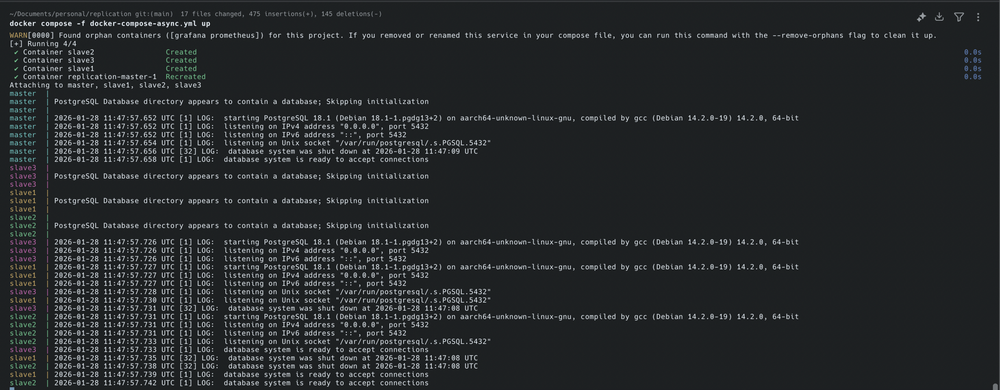
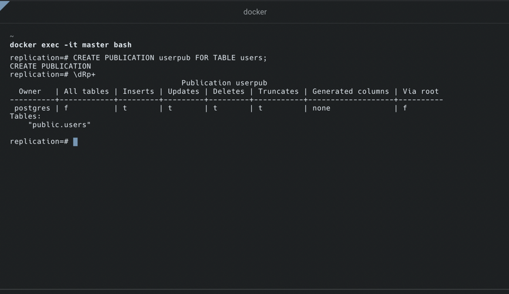
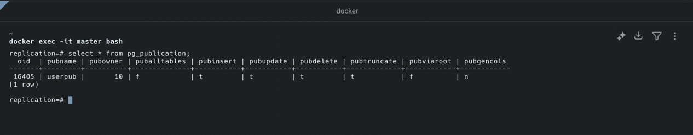
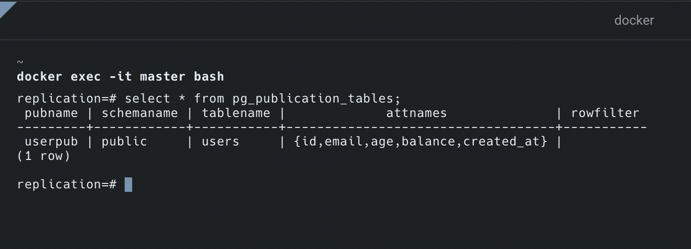
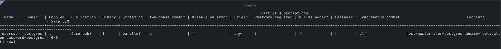
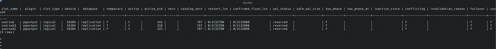

# Asynchronous Replication in PostgresSQL
[here](https://www.postgresql.org/docs/current/logical-replication.html)

In Postgres, we can achieve asynchronous replication (logical replication) using WAL streaming and replay mechanisms.

Postgres achieves logical replication using the popular `Pub/Sub` pattern where there is a particular entity regarded as
master or source-of-truth publishing events or data to other entities in the system regarded as `listeners` or `subscribers`

In Postgres a `Publication` is created on specific tables on the `master` db and when any changed occurs. `Publication` are
sent on DML operations except `TRUNCATE` statements, this means if the `master` performs a truncate query the `subscribers`
won't be aware of these changes.

_**DML Operations={INSERT,UPDATE,DELETE,TRUNCATE}_**

It is important to know that schema changes are not also published to subscribers and both `publishers` & `subscribers`
don't need to have the same schema.

## Syntax

Creating a publication for a table
```postgresql
CREATE PUBLICATION <publication_name> FOR TABLE <table_name> OPTIONS
```
Subscriber
```postgresql
CREATE SUBSCRIPTION <subcription_name> 
    CONNECTION 'host=<master_host_name> user=<master_user_name> dbname=<table_name> password=<password>'
PUBLICATION <master_publication_name>
```

## Configuration
When configuring `publishers` and `subscribers` in postgres there is important information to keep track of

* `max_wal_senders`: this sets the maximum number of `subcribers` that can connect to a `publisher`
* `max_replication_slots`: this configures the maximum number of replication slots. This should be done before starting the app. _David: read on replication slots, I don't yet understand it_
* `wal_keep_size`: this specifies the minimum WAL file size kept in the `pg_wal` directory. 

## Walkthrough
For this example, we have a table called `users` in the master and followers(_we have three followers_), the master db
receives input and must stream these changes to the followers, this is a walkthrough on how it is achieved.

First this walkthrough uses the `docker-compose-async.yml` file, start up the containers using the command below.

```bash
docker compose -f docker-compose-async.yml up
```

You should see this, meaning we are set to go


Next, we are going to connect to these instances and run the [init.sql](../../scripts/init.sql) in each instance. Once this
is done, we have laid the foundation for everything we need.

In the `master` instance let's create a publication on the user's table
```postgresql
CREATE PUBLICATION userpub FOR TABLE users
```
Then next run `dRp+` command to see all publications in `master`


Here we see the `publication` is not for all tables if affects all command
`inserts,updates,deletes and truncates`

You can also run these commands to see other information 
```postgresql
SELECT * FROM pg_publication
```
You get this

Or 
```postgresql
SELECT * FROM pg_publication_tables;
```
You get this


Awesome, I have been able to set up my `publication` on my `master` db, moving on to the subscription.

Create subscription on the first follower db `slave1`
```postgresql
CREATE SUBSCRIPTION usersub
    CONNECTION 'host=master user=postgres dbname=replication password=postgres'
PUBLICATION userpub;
```
Then run `dRs+` on follower instance to see all subscriptions created.
You get this.

This shows the subscription was created successfully. One thing I noticed here is that the connection information is stored in plaintext
meaning I have to find out how to securely connect.

Run this same command for the remaining followers changing the subscription name only. I ran into this error when I executed the same
command for `follower2`. 
```postgresql
ERROR:  could not create replication slot "usersub": ERROR:  replication slot "usersub" already exists
```
Digging into it, I found out that when a `subcription` is created postgres creates a `replication_slot` on the `master` using the name
of the subscription as a unique identifier.

After all these, confirm all replication slots are created on the publisher node (master)
```postgresql
SELECT * FROM pg_replication_slots
```


---
Next thing to be done is do spin up the go server by go running
```go
go run main.go
```
Before we load test open separate terminals for each postgres instance (master, slave1,slave2,slave3), we want to monitor
the count of data for each instance to do this we run
```postgresql
SELECT COUNT(*) from users
```
then
```postgresql
\watch 1
```
This creates a realtime monitoring process on the last query executed.

Nex let's open another terminal, cd into `load` folder and run
```bash
k6 run main.ts
```
This will fire `10000` post requests to the `async-users` endpoint and this handler would write it to the master.
You will see how the count of each instance in realtime changes as master publishes data to the followers


<video width="640" height="480" controls>
  <source src="./docs/monitoring.mp4" type="video/mp4">
  Your browser does not support the video tag.
</video>


---
## Just a note
I went through a funny issue while setting it up, I pointed all the instances to the same volume and it lead me to
this error

After different debugging, reading and gpting it just flashed into my memory that I was using the same volume for everything
```postgresql
ERROR: relation not found oid 24508
```
Do I fully understand everything? Nope! But yeah, I am logging this here for my future me.
